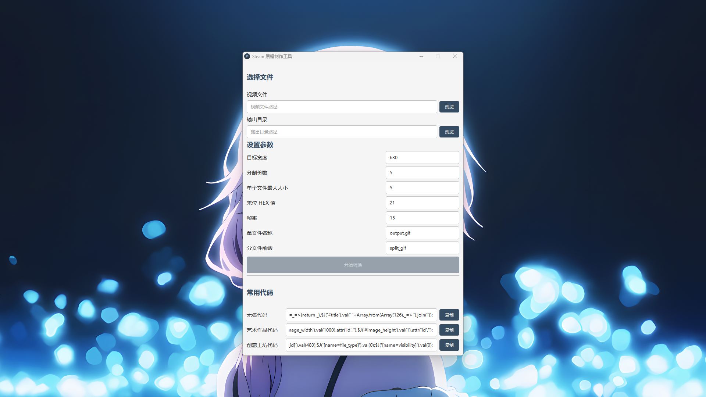

# 简介

一个基于 PySide6 + OpenCV 的 GUI 工具，用于制作 Steam 展柜使用的 GIF 文件



### 功能特点

-   视频转 GIF（MP4、AVI、MOV 等格式）
-   可选 GIF 切割（等宽分割为 N 份）
-   可修改 GIF 文件最后字节
-   简洁的 GUI 操作
-   支持 Windows/Linux/macOS

### 开发

确保你的 Python 版本 >= 3.8

#### 安装依赖

```
pip install -r requirements.txt
```

### 法律声明

本软件采用 CC BY-NC 4.0 许可证，软件著作者享有版权，仅供个人学习使用，禁止本体与衍生品用于任何商业用途
