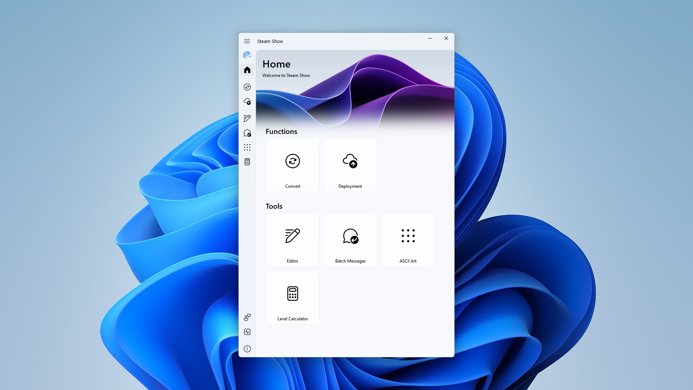

<pre align="center">
<a href="docs/zh_CN.md">简体中文</a> | <a href="docs/zh_TW.md">繁體中文</a> | <a href="docs/ja_JP.md">日本語</a>
</pre>

# Steam Show

##### A GUI developed by PySide6, used to create and deploy Steam personal profile showcases

### Introduction



#### Features

-   Video(MP4, AVI, MOV, etc.) to GIF converter
-   Built-in deployment function, making it easy to deploy to Steam profile showcases
-   Provides Editor with preview function, level calculator, etc.

### Download

You can download the latest release from the [Releases](https://github.com/NineNightMeow/Steam-Show/releases) page

### Development

Ensure your Python version is >= 3.8

Usage of PyQt-Fluent-Widgets see [Docs](https://qfluentwidgets.com/pages/about)

> [!WARNING]
> Please ensure you have installed the PySide6-Fluent-Widgets, for the program may crash  
> [Learn more](https://qfluentwidgets.com/pages/install)

#### Install dependencies

```
pip install -r requirements.txt
```

#### Packing

This application uses Nuitka to pack

```
python -m nuitka --standalone --onefile --windows-console-mode=disable --main="main.py" --plugin-enable=pyside6 --windows-icon-from-ico="src/icons/favicon.ico" --include-data-dir=src=src  --output-filename="Steam-Show" --output-dir="dist" --remove-output --show-progress
```

#### Translations

Translate files are located in `src/i18n/`, use Qt Linguist to finish the translation

### Contribution

We'd like you to contribute [Issues](https://github.com/NineNightMeow/Steam-Show/issues) or [Pull Requests](https://github.com/NineNightMeow/Steam-Show/pulls)

### Sponsor

If this project helps you a lot, please consider sponsoring us 🩷

### License

This project is licensed under the [GPL-3.0 License](https://github.com/NineNightMeow/Steam-Show/blob/main/LICENSE)
