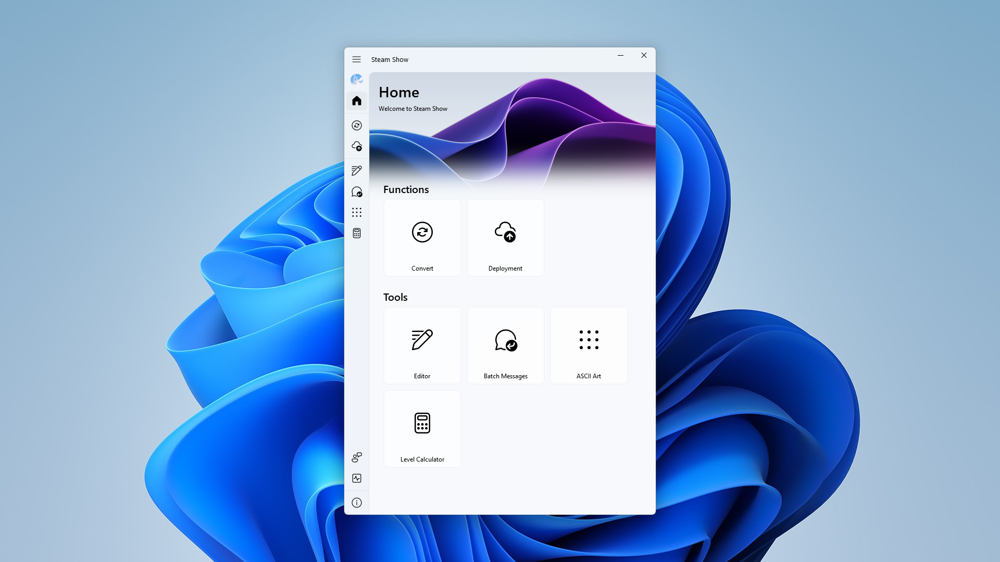

# 簡介

使用 PyQt5 + OpenCV 開發，用於製作與部署 Steam 個人資料展示櫃



### 功能特點

-   將影片（MP4、AVI、MOV 等格式）轉換為展示櫃 GIF 檔案
-   內建部署功能，讓您輕鬆部署到 Steam 個人資料展示櫃

### 開發

確保您的 Python 版本 >= 3.8

#### 安裝依賴

```
pip install -r requirements.txt
```

#### 打包

本軟體使用 Nuitka 進行打包

```
python -m nuitka --standalone --onefile --remove-output --windows-console-mode="disable" --enable-plugins="pyqt5" --output-filename="Steam-Show" --output-dir="dist" --main="main.py" --windows-icon-from-ico="src/icons/favicon.ico"
```

_PyQt-Fluent-Widgets_ 的使用方法請參考 **[官方文件](https://qfluentwidgets.com/pages/about)**

> [!WARNING]
> 請勿混用 PyQt 與 PySide，否則可能導致程式閃退 **[詳見](https://qfluentwidgets.com/pages/install)**

### 法律聲明

本軟體採用 CC BY-NC 4.0 授權，軟體著作作者共同享有版權，僅供個人學習使用，禁止本體與衍生品用於任何商業用途
